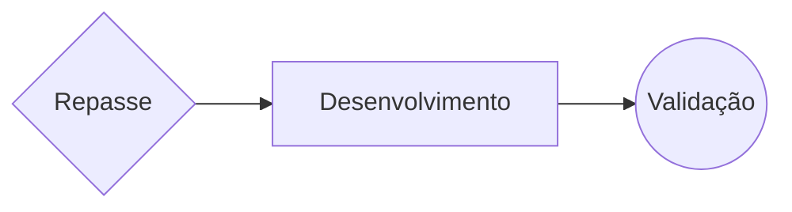
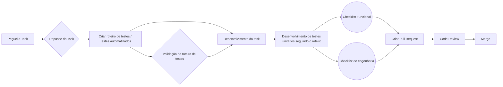

#  Planemath

## Project rules

 - Criação de Branches
	 - Todas as branches devem ser identificadas seguindo o seguinte padrão: `0000-NNNN-Type `
	 - `0000`: Número da Issue
	 - `NNNN`: Nome da Branch 
	 - `Type`: Tipo
	
 - Pull Requests
	- Os Pull Request's também devem ser identificados porém com o padrão: `0000-Description `
	- `0000`:Número da Issue
	- `Description`: Descrição
 - Commits 
 	- Para features: "feat: ...."
	- Para bugs: "bugfix: ..."
	- Para Prova de Conceito: "poc: ..."
  	  

# Gerenciamento de Projeto 

	Pontuações de task, horas por sprint

## Horas

|Membro| Quarta-Feira | Quinta-Feira | Sexta-feira | Segunda-Feira | Terça-Feira |
|--|--------------|--------------|-------------|---------------|-------------|
|Diogo| 2 | 3 | 1 | 8 | 8 |

## Pontuação de task

## Work Flow

